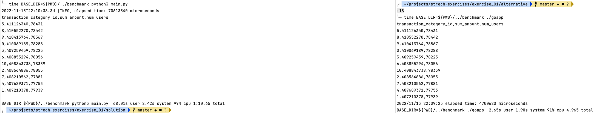

# Joining Data Sets using Std. Python Libraries

<!-- TOC -->
* [Problem](#problem)
* [Proposed Solution](#proposed-solution)
  * [Query](#query)
* [Acceptance Criteria](#acceptance-criteria)
  * [Correctness check](#correctness-check)
  * [Code Quality](#code-quality)
  * [Efficiency](#efficiency)
* [Solution](#solution)
  * [How to run](#how-to-run)
    * [Commands](#commands)
  * [The Logic](#the-logic)
  * [Product Questions](#product-questions)
  * [Tech Questions and Decisions](#tech-questions-and-decisions)
* [Solution Limitations](#solution-limitations)
* [Performance Analysis](#performance-analysis)
  * [Solution](#solution-1)
  * [Reference](#reference)
  * [Alternative](#alternative)
<!-- TOC -->

## Problem

As a stakeholder, I want to receive a report about non-blocked transactions in terms of cumulative transactions amount
and total number of unique active users broken down by transaction category.

## Proposed Solution

Unfortunately the query planner of our database can not optimize the query well enough in order to get the results.
It is proposed to develop a python application to join two tables, `users` and `transactions`:

```sql
CREATE TABLE transactions
(
    transaction_id          UUID,
    date                    DATE,
    user_id                 UUID,
    is_blocked              BOOL,
    transaction_amount      INTEGER,
    transaction_category_id INTEGER
);

CREATE TABLE users
(
    user_id   UUID,
    is_active BOOLEAN
);
```

The application shall implement the business logic described in the query below.

### Query

```sql
SELECT t.transaction_category_id,
       SUM(t.transaction_amount) AS sum_amount,
       COUNT(DISTINCT t.user_id) AS num_users
FROM transactions t
JOIN users u USING (user_id)
WHERE t.is_blocked = False
  AND u.is_active = 1
GROUP BY t.transaction_category_id
ORDER BY sum_amount DESC;
```

## Acceptance Criteria

- Python application is developed to perform required calculations and print the result to _stdout_.
- The application satisfies the following success criteria:
    - [Correctness](#correctness-check)
    - [Code quality](#code-quality)
    - [Efficiency](#efficiency)
- Only the standard python libraries are allowed to be used.
- The solution does not concern SQL parsing.
- The solution is not generic, it does only concern the described problem.

### Correctness check

Data quality assurance is performed according to the following test scenario.

**GIVEN**

- The inputs `users.csv` and `transactions.csv` generated using the [script](.dev/generate_data.py);

**WHEN**

- The logic is executed end-to-end;

**THEN**

- The program output matches the reference generated by postgres.

### Code Quality

Linting applied:

- black
- flak8
- mypy
- isort

### Efficiency

Metrics:

- Execution time
- Memory allocation

_References_:

- https://wiki.python.org/moin/TimeComplexity
- https://realpython.com/sorting-algorithms-python/

## Solution

The solution is provided in the [solution](solution) directory.

### How to run

_Requirements_:

- [docker](https://docs.docker.com/get-docker/) ~> 20.10
- [gnuMake](https://www.gnu.org/software/make/)

#### Commands

Run to see available commands:

```commandline
make help
```

_First_, set the environment:

```commandline
make setup
```

_Second_, run the unit tests and the [data quality assessment](#code-quality):

```commandline
make tests
```

_To run the application_, execute the following command:

```commandline
make run
```

**Note**: the application uses the csv files generated during the setup step.

Run the following command to use _custom_ `users.csv` and `transactions.csv` files as the input data:

```commandline
make run BASE_DIR=##path/to/users/and/transactions/csv##
```

Run to perform application profiling on pre-generated data:

```commandline
make profiling
```

Run to clean up the local environment:

```commandline
make clean
```

### The Logic

1. Store the ID of _active_ users in memory as a [`Set`](https://docs.python.org/3.9/tutorial/datastructures.html#sets):
    - Benefits:
        - Minimisation of memory allocation:
            - Only the smaller dataset is stored in memory in full;
            - Only unique users are stored in memory.
    - Requirements:
        - `WHERE` clause condition to be applied in-flight: filtering for `is_active` when reading the file
          line-by-line.
        - The array of `user_id` is fully stored in memory to realise the join condition.
2. Extract _relevant_ attributes of non-blocked transactions done by _active_ users:
    - Benefits:
        - Minimisation of memory allocation
    - Requirements:
        - `WHERE` clause condition to be applied in-flight: filtering for `is_blocked` when reading the file
          line-by-line.
        - `JOIN` clause condition to be applied in-flight: filtering for `user_id` to be in the set from the step 1.
        - Select `transaction_category_id`, and `transaction_amount` only to deliver required data.
3. Store the map of `transaction_category_id` to cumulative `transaction_amount` and array of _unique_ `user_id` in
   memory as a [`Dict`](https://docs.python.org/3.9/tutorial/datastructures.html#dictionaries).
    - Benefits:
        - Minimisation of memory allocation for `transaction_amount`.
        - Minimisation of memory allocation by preserving unique `user_id` only.
    - Requirements:
        - The equivalent of the [query](#query) operation `SUM(t.transaction_amount)` to be applied on the fly.
        - Uniqueness of `user_id` associated with a given category is guaranteed by design of
          the [`Set`](https://docs.python.org/3.9/tutorial/datastructures.html#sets) data type.
    - Limitations:
        - Array of `user_id` would have to be preserved to keep state of users mapped to a given transaction category to
          execute the equivalent of the [query](#query) operation `COUNT(DISTINCT user_id)`.
4. Calculate the number of unique active users associated with the transaction category.
5. Sort by the total transaction amount.
6. Output.

### Product Questions

- Does input's validation required?
    - The solution is being delivered under the assumption of positive answer.
      <br>The reason: data quality for analytics is more critical than performance.

### Tech Questions and Decisions

- How to store user_id and transaction_id in memory?
    - UUID vs. str: what leads to higher memory allocation? <br>_The answer_: str required more memory to store an
      object:

```commandline
In [1]: uid = "9f709688-326d-4834-8075-1a477d590af7"

In [2]: uid.__sizeof__()
Out[2]: 85

In [3]: from uuid import UUID

In [4]: uid_uuid = UUID(uid)

In [5]: uid_uuid.__sizeof__()
Out[5]: 40
```

- Would use of `dataclass` lead to higher memory allocation? <br> <br>_The answer_: no, en contraire; on top, it
  improves code quality:

```commandline
In [1]: from uuid import UUID
In [2]: Transaction = tuple[UUID, UUID, int, int]

In [3]: from dataclasses import dataclass

In [4]: @dataclass
   ...: class Transaction1:
   ...:     transaction_id: UUID
   ...:     user_id: UUID
   ...:     transaction_amount: int
   ...:     transaction_category_id: int
   ...: 
In [5]: t0 = Transaction((UUID("9f709688-326d-4834-8075-1a477d590af7"), UUID("999eb541-c1a0-4888-aeb6-92773fc60e69"), 1, 1))

In [6]: t1 = Transaction1(UUID("9f709688-326d-4834-8075-1a477d590af7"), UUID("999eb541-c1a0-4888-aeb6-92773fc60e69"), 1, 1)

In [7]: t0.__sizeof__()
Out[7]: 56

In [8]: t1.__sizeof__()
Out[8]: 32
```

- Which sorting algorithm would suffice the cardinality of the problem?
    - Costs-benefit tradeoff: delivery effectiveness vs. technical efficiency, i.e. development complexity vs.
      time-complexity gain.
      <br>_Hypothesis_: the standard `sort` would be as efficient as it is feasibly possible because the data
      cardinality, or the number of sorted array's elements does not exceed a dozen. The hypothesis is based on personal
      user experience, provided fixtures generation [script](.dev/generate_data.py)
      and [the article](https://realpython.com/sorting-algorithms-python/) illustrating different
      sorting algorithms implementation in python.

- When reading file, is [`csv` library](https://docs.python.org/3.9/library/csv.html) more efficient than line-by-line
  reading with `open`?

## Solution Limitations

**The whole set of active users identifiers has to be stored in memory. What if it does not fit?**

It is the problem for large datasets which could be typically resolve either by vertical, or horizontal scaling of
the computation unit.

Vertical scaling is the straightforward approach: increase the amount of memory, so it fits the amount of data.

Horizontal scaling is achieved by parallel execution of computations following the "map-reduce" logic:

- _Map_:
    - The data are distributed across a cluster of computation nodes according to distribution criteria, e.g. using
      round-robin, or hashing algorithm.
    - The computation for a certain data set is performed on a certain node.
- _Reduce_:
    - The Map's result is collected on a single node and aggregated to get the final result.

Apart from networking and orchestration overhead, the _reduce_ operation could hit the resource bottleneck in line with
the initial question. In such case, the "map-reduce" process could be repeated, or the resources quota for the "reduce
node" could be raised.

## Performance Analysis

The section touches upon the logic performance.

The benchmarking was performed on the data generated using the [script](.dev/generate_data.py):

- users.csv with 1 Million rows
- transactions.csv with 100 Million rows

| Logic                        | Elapsed Time [sec.] | RAM uplift [Mb] | CPU max [% of .5 unit] |
|:-----------------------------|--------------------:|----------------:|-----------------------:|
| [Reference](#reference)      |              70.184 |            ~ 50 |                   < 60 |
| [Solution](solution)         |             434.595 |           ~ 250 |                   < 60 |
| ["Alternative"](alternative) |             408.809 |           ~ 130 |                   < 30 |

**Note**: the benchmark is based on a single run on a MacBook Pro with Apple M1 Pro and 16Gb of RAM. It shall only be
considered as a qualitative illustration rather than quantitative thorough comparison taking statical significance into
account.

**Note**: The "alternative" label corresponds to the logic [implemented in Go](alternative).

### Solution

```commandline
╰─ make run BASE_DIR=${PWD}/benchmark
2022-11-06T22:07:55.006 [INFO] elapsed time: 434.595 sec.
transaction_category_id,sum_amount,num_users
5,411126340,78431
8,410552270,78442
9,410413764,78567
0,410069189,78288
3,409259459,78225
6,408855294,78056
10,408843738,78339
2,408564886,78055
7,408210562,77881
4,407689371,77753
1,407210378,77939
```

The resources consumption assessed using `docker stats`:

- CPU: up to 50% of 0.5 CPU
- RAM: up to 270Mb from <10Mb

### Reference

Postgres with the buffer setting of 128 kB (minimal possible value) is used as the reference. Its performance is
illustrated as following:

```commandline
EXPLAIN ANALYSE INSERT INTO benchmark.result
SELECT t.transaction_category_id,
       SUM(t.transaction_amount) AS sum_amount,
       COUNT(DISTINCT t.user_id) AS num_users
FROM benchmark.transactions t
         JOIN benchmark.users u USING (user_id)
WHERE NOT t.is_blocked
  AND u.is_active
GROUP BY t.transaction_category_id
ORDER BY sum_amount DESC
;
QUERY
PLAN                                                                               
-----------------------------------------------------------------------------------------------------------------------------------------------------------------------
 Insert on result  (cost=2214662.55..2214662.74 rows=11 width=12) (actual time=70110.004..70110.004 rows=0 loops=1)
   ->  Subquery Scan on "*SELECT*"  (cost=2214662.55..2214662.74 rows=11 width=12) (actual time=70109.873..70109.875 rows=11 loops=1)
         ->  Sort  (cost=2214662.55..2214662.58 rows=11 width=20) (actual time=70109.861..70109.861 rows=11 loops=1)
               Sort Key: (sum(t.transaction_amount)) DESC
               Sort Method: quicksort  Memory: 25kB
               ->  GroupAggregate  (cost=2209223.12..2214662.36 rows=11 width=20) (actual time=69394.877..70109.832 rows=11 loops=1)
                     Group Key: t.transaction_category_id
                     ->  Sort  (cost=2209223.12..2210582.90 rows=543913 width=24) (actual time=69307.383..69539.604 rows=899728 loops=1)
                           Sort Key: t.transaction_category_id
                           Sort Method: external merge  Disk: 29872kB
                           ->  Merge Join  (cost=2131723.26..2146252.70 rows=543913 width=24) (actual time=67670.559..68884.249 rows=899728 loops=1)
                                 Merge Cond: (t.user_id = u.user_id)
                                 ->  Sort  (cost=2048810.31..2051193.65 rows=953335 width=24) (actual time=66815.998..67139.747 rows=999824 loops=1)
                                       Sort Key: t.user_id
                                       Sort Method: external merge  Disk: 33192kB
                                       ->  Seq Scan on transactions t  (cost=0.00..1934580.64 rows=953335 width=24) (actual time=2.073..65180.612 rows=999824 loops=1)
                                             Filter: (NOT is_blocked)
                                             Rows Removed by Filter: 99000176
                                 ->  Materialize  (cost=82912.95..85795.37 rows=576485 width=16) (actual time=854.553..1347.073 rows=1231088 loops=1)
                                       ->  Sort  (cost=82912.95..84354.16 rows=576485 width=16) (actual time=854.548..1218.244 rows=900081 loops=1)
                                             Sort Key: u.user_id
                                             Sort Method: external merge  Disk: 22824kB
                                             ->  Seq Scan on users u  (cost=0.00..17899.70 rows=576485 width=16) (actual time=0.135..256.031 rows=900081 loops=1)
                                                   Filter: is_active
                                                   Rows Removed by Filter: 99919
 Planning time: 1.170 ms
 Execution time: 70183.707 ms
(27 rows)
```

Results:

```commandline
 SELECT * FROM benchmark.result;
 transaction_category_id | sum_amount | num_users 
-------------------------+------------+-----------
                       5 |  411126340 |     78431
                       8 |  410552270 |     78442
                       9 |  410413764 |     78567
                       0 |  410069189 |     78288
                       3 |  409259459 |     78225
                       6 |  408855294 |     78056
                      10 |  408843738 |     78339
                       2 |  408564886 |     78055
                       7 |  408210562 |     77881
                       4 |  407689371 |     77753
                       1 |  407210378 |     77939
(11 rows)
```

Database read from cache illustration:

```commandline
SELECT heap_blks_read, heap_blks_hit from pg_statio_user_tables where relname='transactions' and schemaname='benchmark';
heap_blks_read | heap_blks_hit
----------------+---------------
1899420 |       1868898
(1 row)

SELECT heap_blks_read, heap_blks_hit from pg_statio_user_tables where relname='users' and schemaname='benchmark';
heap_blks_read | heap_blks_hit
----------------+---------------
19113 |         12735
```

The resources consumption assessed using `docker stats`:

- CPU: up to 50% of 0.5 CPU
- RAM: up to 150Mb from 100Mb

### Alternative

```commandline
╰─ make go.run BASE_DIR=${PWD}/benchmark
transaction_category_id,sum_amount,num_users
5,411126340,78431
8,410552270,78442
9,410413764,78567
0,410069189,78288
3,409259459,78225
6,408855294,78056
10,408843738,78339
2,408564886,78055
7,408210562,77881
4,407689371,77753
1,407210378,77939
2022/11/13 21:41:16 elapsed time: 408809199 microseconds
```

The resources consumption assessed using `docker stats`:

- CPU: up to 25% of 0.5 CPU
- RAM: up to 130Mb from <10Mb

The screenshot below illustrates a qualitative performance comparison between the Python and Go applications aggregating
100 mil. transactions for 1 mil. users. The image shows the result of a single execution on a MacBook Pro with Apple
M1 Pro and 16Gb of RAM without locking the process and limiting the resource quota.



The Go application (on the _right_) is roughly 15-fold faster compared to the Python app (on the _left_).
